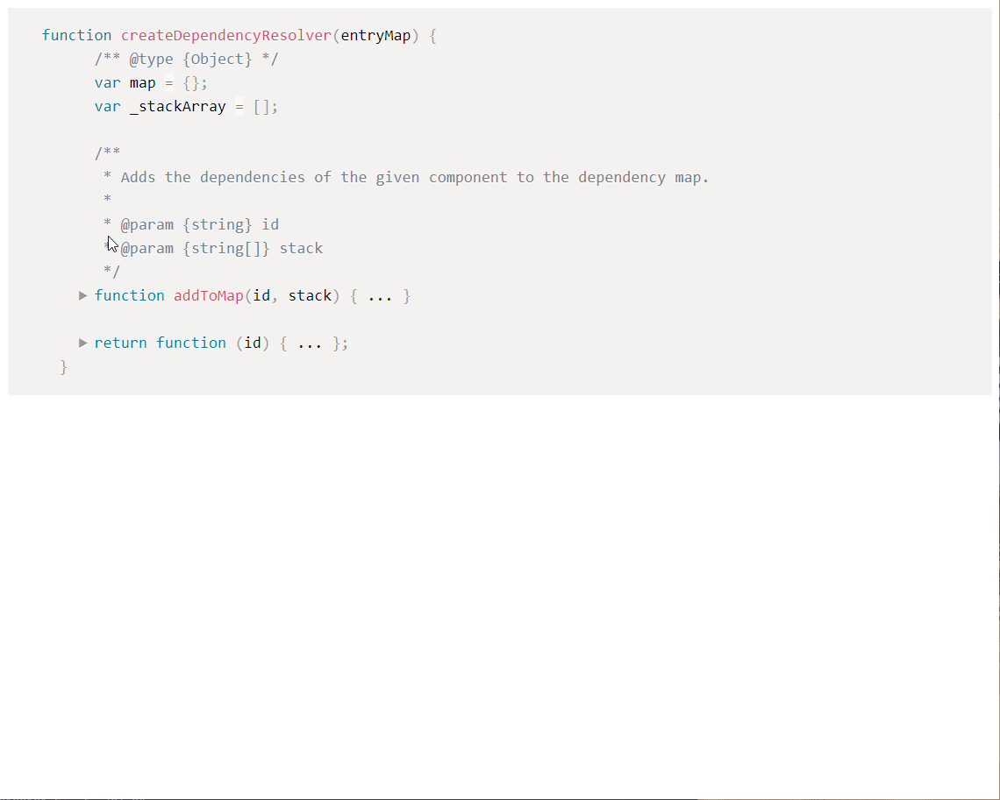
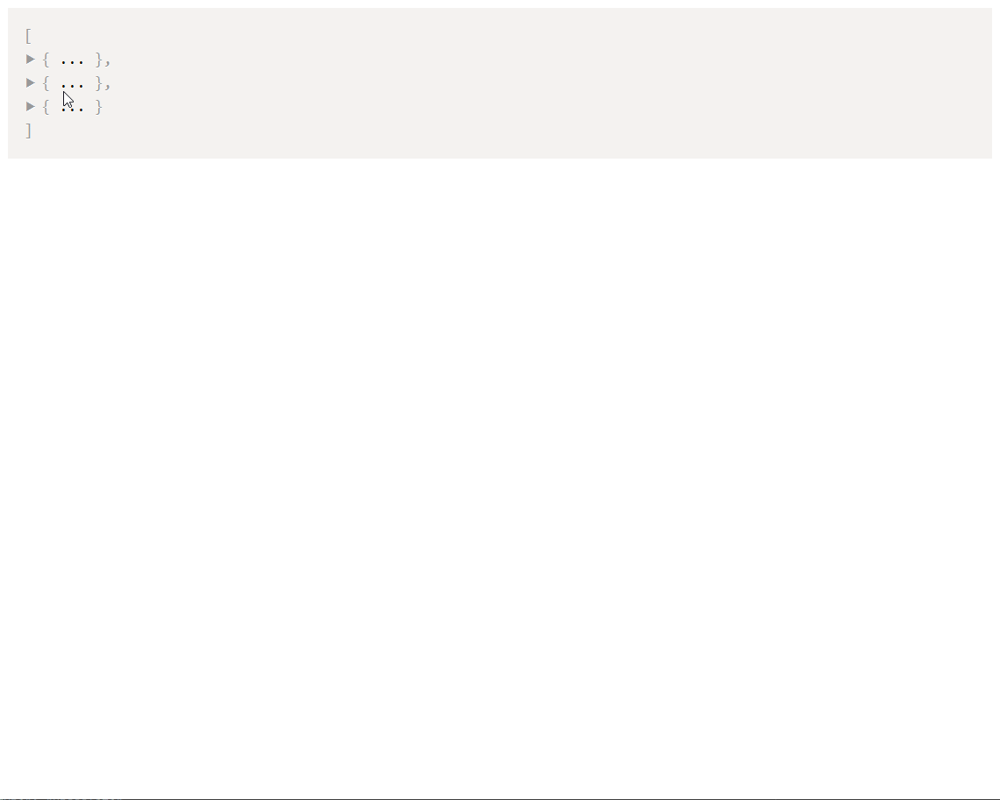

# Prism JS fold
> Add code folding to JSON & JavaScript objects & arrays.





## Table of Contents
* [Setup](#setup)
* [Why Insert Details Tags?](#why-insert-ltdetailsgt-tags)
* [CSS](#css)
* [Authors &amp; License](#authors--license)

This plugin parses the input to Prism and wraps {} & [] pairs in a &lt;details&gt; tag to provide code folding.

1. Adds a `before-all-elements-highlight` handler to Prism hooks.
2. Reads the input about to be highlighted by Prism.
3. Iterates over the characters finding interesting characters and inserting tags.
4. Updating the HTML before Prism then highlights it.

This algorithm should work for any C-like language though I haven't had the data set to test it on.

Note: This approach requires the `Keep Markup` plugin since we're adding tags before Prism highlights.

## Setup
Install from npm:

```sh
npm i prism-js-fold
```

Require or import it after Prism.

```js
import 'prismjs'
import 'prism-js-fold'

// commonjs
require('prismjs')
require('prism-js-fold')
```

or use via it a CDN:

```html
<script type="text/javascript" src="https://unpkg.com/prismjs"></script>
<script type="text/javascript" src="https://unpkg.com/prismjs/plugins/keep-markup/prism-keep-markup.js"></script>
<script type="text/javascript" src="https://unpkg.com/prism-js-fold"></script>
```

See `demo.html` in this repo for a simple example of it working via CDN.

## Why insert &lt;details&gt; tags?
This is the approach [suggested by the Prism developer](https://github.com/PrismJS/prism/pull/1045#issuecomment-259800423) 
and requires the least parsing and coupling possible. Additionally, by using semantic HTML we avoid having to attach any JavaScript 
events, preventing any possibility of event related memory leaks.

## CSS
The CSS required for layout in available in `prism-js-fold.css` included with this package. If you'd like to recolor 
toggle for your theme, provided a rule for `code summary > span:first-child::before` following the included CSS.


## Authors & License
[Nils Lundquist](https://github.com/nlundquist)

CC-BY-SA-4.0